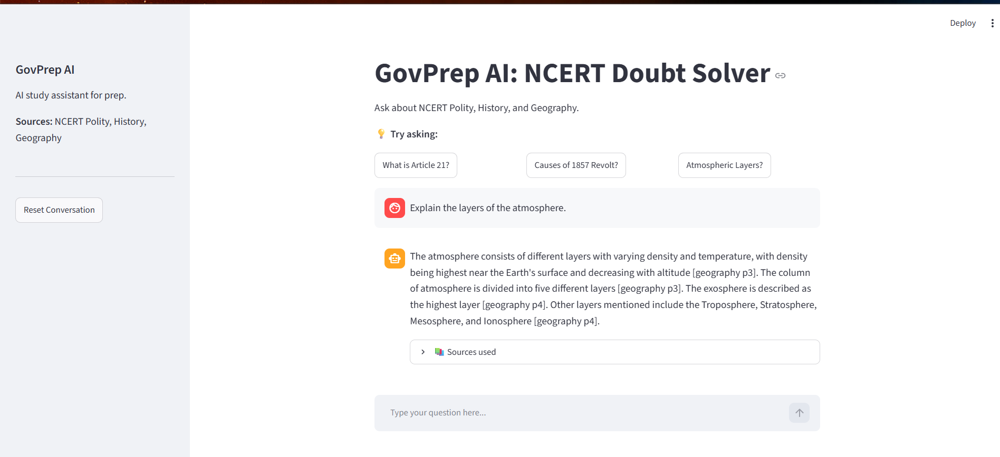

# GovPrep AI — Production RAG Assistant for Indian Government Exam Prep

Ask a government-exam question in plain language and get a grounded, source-cited answer drawn from NCERT study material — and a clear *"not in my sources"* when the answer isn't there, instead of a hallucinated guess.

Built end to end to understand production-grade retrieval-augmented generation (RAG): retrieval, evaluation, grounding, observability, and serving — not just a wrapper around an LLM API.



**🔗 Live demo:** https://govprep-frontend-55025882120.us-central1.run.app
> ⏳ First load may take up to a minute while the server wakes from idle.

**💻 Code:** https://github.com/12PrashantKumar/govprep

---

## What it does

- Answers exam-prep questions (Polity, History, Geography) grounded **only** in the source material, with source attribution.
- Refuses to answer when the retrieved passages don't support it — reducing hallucination instead of guessing.
- Runs two modes: a fixed RAG pipeline (`/chat`) and an **agentic mode** (`/chat/agent`) that routes between corpus search and live web search.
- Served as a FastAPI backend with a Streamlit web frontend.

## Architecture

```
Streamlit frontend  ──HTTP──>  FastAPI backend  ──>  RAG pipeline  ──>  Postgres + pgvector
  (pg_app.py)                   (pg_api.py)          rewrite ->            (Neon, hybrid
                                /chat, /chat/agent    guardrails ->         dense + BM25)
                                Pydantic-validated    hybrid retrieve ->
                                                      generate
```

The frontend and backend are decoupled services — the UI sends questions over HTTP and renders validated JSON; the backend owns the pipeline.

- **Backend:** FastAPI — `/chat` (RAG pipeline) and `/chat/agent` (agentic ReAct mode)
- **Retrieval:** Hybrid search — dense (pgvector) + sparse (Postgres full-text / BM25) fused with **Reciprocal Rank Fusion (RRF)**
- **Pipeline:** query rewriting (resolves follow-ups) → security guardrails → hybrid retrieval → grounded generation with source citation
- **Agent:** LangGraph ReAct agent with tool-calling (corpus search, live web search, calculator), max-iteration limits, and **graceful fallback to the core RAG pipeline** when tool-calling fails — so the user always gets a grounded answer
- **Security:** red-team tested against OWASP LLM01 (Prompt Injection); rigid SystemMessage isolation blocks jailbreaks and persona overrides (see `SECURITY.md`)
- **Database:** PostgreSQL + pgvector (Neon)
- **Embeddings:** sentence-transformers `all-mpnet-base-v2` (local, 768-dim)
- **LLM:** Groq — Llama 3.3 70B
- **Observability:** LangFuse — every agent step, tool call, token cost, and latency is traced
- **Deployment:** Docker on GCP Cloud Run

## Evaluation

Retrieval quality was measured, not assumed — and generation quality too. Scored against a 24-question gold set (across all three subjects, each tagged with a required keyword and expected subject).

| Layer | Metric | Score |
|-------|--------|-------|
| Retrieval | Hit Rate@3 | 0.375 |
| Retrieval | MRR | 0.243 |
| Generation | Faithfulness (LLM-as-a-judge) | 4.30 / 5 |

Retrieval uses **strict** matching (a hit counts only when the correct keyword *and* subject appear), which undercounts semantically-correct retrievals — so real-world relevance is higher than the raw number suggests. Faithfulness (4.30/5) confirms generated answers are well-grounded in the retrieved context. Full method and limitations in `EVALUATION.md`.

## How it works

**Ingestion** (run once): `PDFs → text extraction → chunking → embeddings → Postgres/pgvector`

**Query** (every question):
```
question + history
   -> rewrite to a self-contained query (resolves follow-ups)
   -> security guardrails (prompt-injection + PII checks)
   -> hybrid retrieve (dense + BM25 + RRF)
   -> build grounded prompt (passages + sources)
   -> generate answer, cited to source
```

## Current corpus

Indexed over NCERT Class 11 textbooks — Political Science (*Indian Constitution at Work*), History (*Themes in World History*), and Geography (*Fundamentals of Physical Geography*). The ingestion pipeline loads any text-layer document placed in the subject folders, so more subjects and sources can be added over time.

## Project structure

```
govprep/
├── pg_api.py                    # FastAPI entrypoint (/chat, /chat/agent)
├── pg_app.py                    # Streamlit frontend (calls the API over HTTP)
├── scripts/
│   ├── pg_hybrid_retriever.py   # dense (pgvector) + BM25 + RRF retrieval
│   ├── pg_rewriter.py           # query rewriting for follow-ups
│   ├── pg_guardrails.py         # prompt-injection + PII checks
│   ├── pg_ingest.py             # NCERT PDF ingestion pipeline
│   ├── agent.py                 # LangGraph agent + tools + graceful fallback
│   └── pg_eval_ragas_hybrid.py  # evaluation harness
├── eval/
│   └── gold_set.json            # evaluation questions
├── data/  polity/ history/ geography/   # NCERT PDFs (not committed)
├── Dockerfile.backend
├── SECURITY.md                  # threat model + red-team report
├── EVALUATION.md                # eval method, results, limitations
└── requirements.txt
```

## Setup

```bash
git clone https://github.com/12PrashantKumar/govprep.git
cd govprep
python -m venv venv
venv\Scripts\activate          # Windows  (source venv/bin/activate on macOS/Linux)
pip install -r requirements.txt
# create a .env with DATABASE_URL, GROQ_API_KEY, TAVILY_API_KEY, and LangFuse keys
```

Ingest the corpus, then run backend + frontend:
```bash
python scripts/pg_ingest.py                 # one-time: load, chunk, embed, store
uvicorn pg_api:app --reload                 # terminal 1 — backend
streamlit run pg_app.py                     # terminal 2 — frontend
```

## Roadmap

Planned next steps: retrieval tuning (chunking, embedding model), semantic caching, an explicit agentic router, CI/CD pipeline, and re-running RAGAS with an OpenAI judge. .

## Notes

Source PDFs and API keys are not committed. Built as a learning project to understand production-grade RAG end to end — retrieval, evaluation, grounding, observability, and serving.